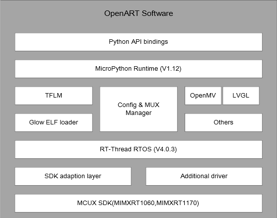
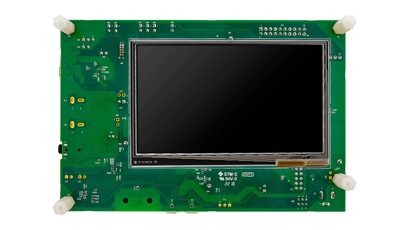
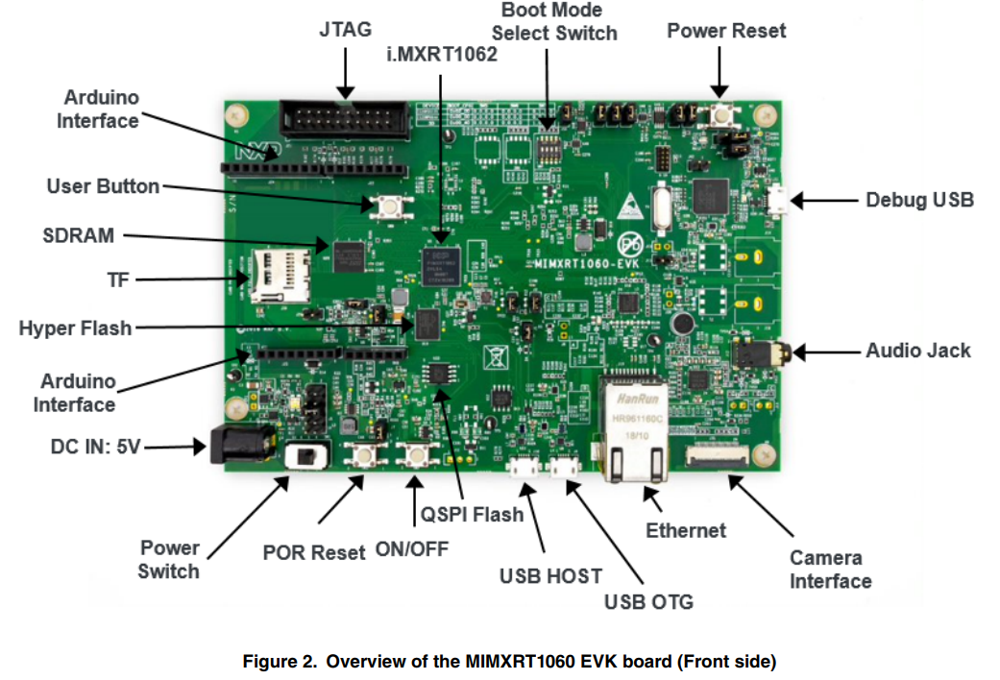
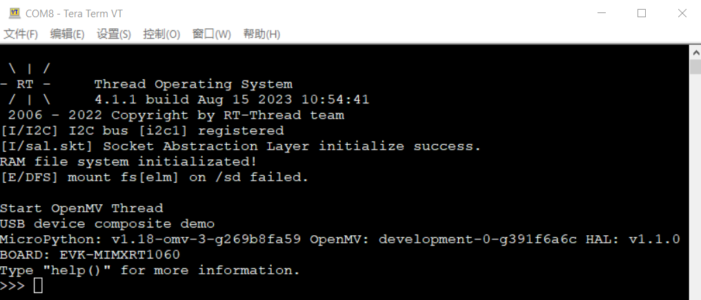
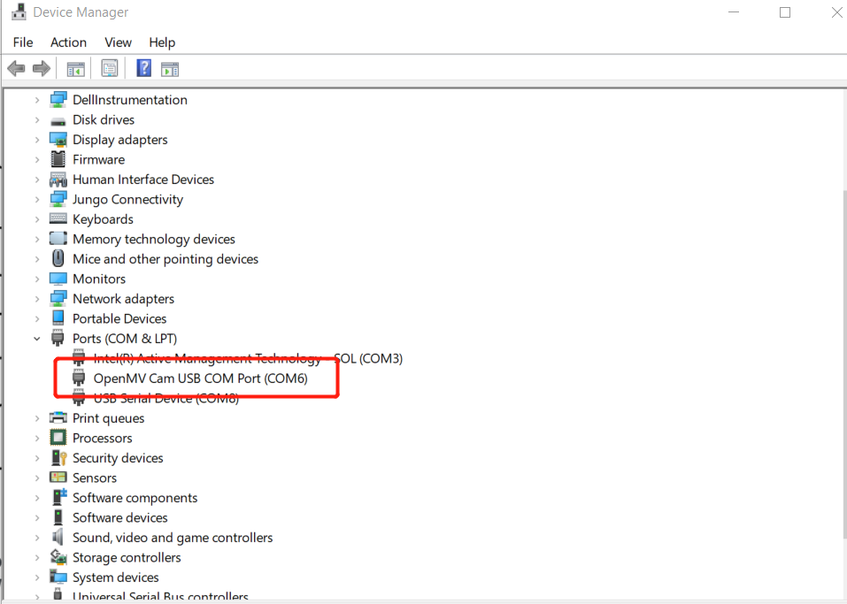
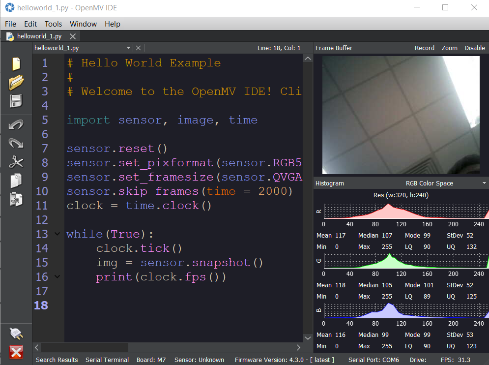

# NXP Application Code Hub

[](https://www.nxp.com)

## ML-OpenART

OpenART is an open source AI develop and verify kit based on OpenMV, which supports most popular machine learning inference engines: TFlite-Micro.

It provides a convenient and efficient method to verify the modes: execute the modes in python script based on micropython and OpenMV library, and also support LVGL python bindings library, that means you can implement an AI application with UI by python too.

**General Purpose**

* **AI Education**
  Support most popular AI Engines: TFlite-Micro, Glow and with the python binding, people could execute the models in python script. Profile method is supported too, it can count inference time cost for each layers of the model.
* **Machine Vision**
  Support OpenMV library V4.3. The OpenMV project aims at making machine vision more accessible to beginners by developing a user-friendly, open-source, low-cost machine vision platform.
* **MCU Education**
  Support MicroPython V1.18, easy play with mid-high end MCU/crossovers with Python.

**Four examples are included to demonstrate the deployment of AI models on OpenART.**



#### Boards: EVK-MIMXRT1060

#### Categories: AI/ML

#### Peripherals: ADC, CLOCKS, FLASH, GPIO, PWM, TIMER, UART, DISPLAY, I2C, I2S, USB, VIDEO, SDMMC, SENSOR, PINCTRL

#### Toolchains: MDK

## Table of Contents

1. [Software](#step1)
2. [Hardware](#step2)
3. [Setup](#step3)
4. [Results](#step4)
5. [Examples](#step5)
6. [FAQs](#step6)
7. [Support](#step7)
8. [Release Notes](#step8)

## 1. Software <a name="step1"></a>

* IDE: MDK 5.34
* GIT
* OpenMV IDE ([Download | OpenMV](https://openmv.io/pages/download))

### 1.2 Download Code

**To clone repo with submodules:**

```
git clone --recursive https://github.com/nxp-appcodehub/dm-ml-openart.git
```

**To checkout openMV & submodules version**

```
cd bsp/imxrt/components/openmv
git checkout v4.3.0

cd bsp/imxrt/components/openmv/src/micropython
git checkout v1.18-omv

cd bsp/imxrt/components/openmv/src/omv/modules/ulab
git checkout 4.0.0

```


## 2. Hardware <a name="step2"></a>

* i.MXRT1060 EVK ([MIMXRT1060-EVK Product Information|NXP](https://www.nxp.com/part/MIMXRT1060-EVK#/))
* OV7225 / MT9M114 Camera module
* LCD Panel: [RK043FN66HS](https://www.nxp.com/part/RK043FN66HS-CTG)
* SD Card
* Two usb cables

i.MXRT1060 EVK as :





## 3. Setup <a name="step3"></a>

Enter folder: bsp\imxrt\imxrt1062-nxp-evk, open 'project.uvprojx'  in mdk. Compile the project.

Connect Debug USB with laptop, and flash the board.

## 4. Results <a name="step4"></a>

After board flashed , reset the board. Open term connect the debug serial. The boot log is shown as :



Connect USB OTG with laptop,  "OpenMV Cam USB COM port" is shown up in device manager.


Open OpenMV IDE,  Connect the deivce and excute 'Hello world_1.py',  shown as :


## 5. Examples <a name="step5"></a>

Four AI examples are included in the project:

* [CIFAR10 object recognition](examples/cifar10_lvgl)
* [Face recognition](examples/face_recognize)
* [Gender recognition](examples/gender_detection)
* [Gesture recognition](examples/gesture_recognize)

## 6. FAQs <a name="step6"></a>


## 7. Support <a name="step7"></a>

[OpenMV | Small - Affordable - Expandable](https://openmv.io/)

[MicroPython - Python for microcontrollers](https://micropython.org/)

#### Project Metadata

<!----- Boards ----->

[](https://github.com/search?q=org%3Anxp-appcodehub+EVK-MIMXRT1060+in%3Areadme&type=Repositories)

<!----- Categories ----->

[](https://github.com/search?q=org%3Anxp-appcodehub+aiml+in%3Areadme&type=Repositories)

<!----- Peripherals ----->

[](https://github.com/search?q=org%3Anxp-appcodehub+adc+in%3Areadme&type=Repositories) [](https://github.com/search?q=org%3Anxp-appcodehub+clocks+in%3Areadme&type=Repositories) [](https://github.com/search?q=org%3Anxp-appcodehub+flash+in%3Areadme&type=Repositories) [](https://github.com/search?q=org%3Anxp-appcodehub+gpio+in%3Areadme&type=Repositories) [](https://github.com/search?q=org%3Anxp-appcodehub+pwm+in%3Areadme&type=Repositories) [](https://github.com/search?q=org%3Anxp-appcodehub+timer+in%3Areadme&type=Repositories) [](https://github.com/search?q=org%3Anxp-appcodehub+uart+in%3Areadme&type=Repositories) [](https://github.com/search?q=org%3Anxp-appcodehub+display+in%3Areadme&type=Repositories) [](https://github.com/search?q=org%3Anxp-appcodehub+i2c+in%3Areadme&type=Repositories) [](https://github.com/search?q=org%3Anxp-appcodehub+i2s+in%3Areadme&type=Repositories) [](https://github.com/search?q=org%3Anxp-appcodehub+usb+in%3Areadme&type=Repositories) [](https://github.com/search?q=org%3Anxp-appcodehub+video+in%3Areadme&type=Repositories) [](https://github.com/search?q=org%3Anxp-appcodehub+sdmmc+in%3Areadme&type=Repositories) [](https://github.com/search?q=org%3Anxp-appcodehub+sensor+in%3Areadme&type=Repositories) [](https://github.com/search?q=org%3Anxp-appcodehub+pinctrl+in%3Areadme&type=Repositories)

<!----- Toolchains ----->

[](https://github.com/search?q=org%3Anxp-appcodehub+mdk+in%3Areadme&type=Repositories)

Questions regarding the content/correctness of this example can be entered as Issues within this GitHub repository.

> **Warning**: For more general technical questions regarding NXP Microcontrollers and the difference in expected funcionality, enter your questions on the [NXP Community Forum](https://community.nxp.com/)

[](https://www.youtube.com/@NXP_Semiconductors)
[](https://www.linkedin.com/company/nxp-semiconductors)
[](https://www.facebook.com/nxpsemi/)
[](https://twitter.com/NXP)

## 8. Release Notes <a name="step8"></a>

| Version | Description / Update                    |                                  Date |
| :-----: | --------------------------------------- | ------------------------------------: |
|   1.0   | Initial release on Application Code Hub | August 14 `<sup>`th `</sup>` 2023 |
