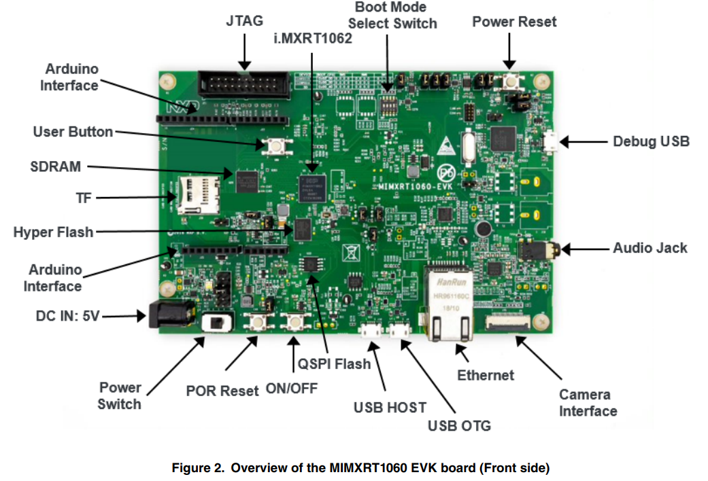

# NXP Application Code Hub

## CIFAR10 with LVGL

**This example demonstrates the utilization of the Cifar10 TF-lite Micro model on OpenART.**

**The model is capable of classifying a picture captured from a camera.**

**A straightforward UI has been implemented using the lvgl python library.**

#### Boards: EVK-MIMXRT1060

#### Categories: AI/ML

#### Peripherals: ADC, CLOCKS, FLASH, GPIO, PWM, TIMER, UART, DISPLAY, I2C, I2S, USB, VIDEO, SDMMC, SENSOR, PINCTRL

#### Toolchains: MDK

## Table of Contents

1. [Software](#step1)
2. [Hardware](#step2)
3. [Setup](#step3)
4. [Run steps](#step4)
5. [FAQs](#step5)
6. [Support](#step6)
7. [Release Notes](#step7)

## 1. Software 

* OpenMV IDE ([Download | OpenMV](https://openmv.io/pages/download))

## 2. Hardware 

* i.MXRT1060 EVK ([MIMXRT1060-EVK Product Information|NXP](https://www.nxp.com/part/MIMXRT1060-EVK#/))
* OV7225 / MT9M114 Camera module
* LCD Panel: [RK043FN66HS](https://www.nxp.com/part/RK043FN66HS-CTG)
* SD Card
* Two usb cables

i.MXRT1060 EVK as :

## 3. Setup 

Connect Debug USB and USB OTG with laptop through cables.
Reset Boards, two COM devices show up in laptop

## 4. Run steps 

1. **Copy the model file, labels.txt, and cifar10_lvgl.py into the SD Card.**
2. **Insert the SD Card into the device and reset the board.**
3. **Open the OpenMV IDE and connect the device.**
4. **Execute the cifar10_lvgl.py script in the OpenMV IDE.**
5. **Show a picture to the camera to test the model; the result will be displayed in the top left label of the UI.**

## 5. FAQs 

## 6. Support 

[OpenMV | Small - Affordable - Expandable](https://openmv.io/)

[MicroPython - Python for microcontrollers](https://micropython.org/)

#### Project Metadata

<!----- Boards ----->

<!----- Categories ----->

<!----- Peripherals ----->

              

<!----- Toolchains ----->

Questions regarding the content/correctness of this example can be entered as Issues within this GitHub repository.

> **Warning**: For more general technical questions regarding NXP Microcontrollers and the difference in expected funcionality, enter your questions on the [NXP Community Forum](https://community.nxp.com/)

## 7. Release Notes 

| Version | Description / Update                    |                                  Date |
| :-----: | --------------------------------------- | ------------------------------------: |
|   1.0   | Initial release on Application Code Hub | August 14 th  2023 |
